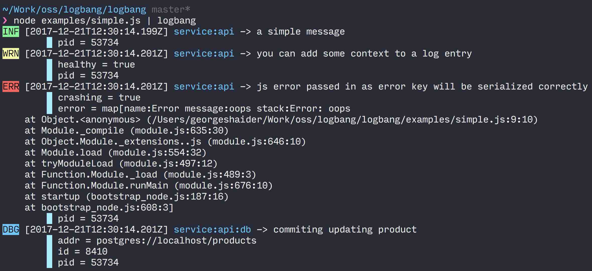

# log!

logbang (aka log!) is a simple, structured logging library. This repository implements a logger for node.js and browsers. It also acts as the reference implementation for log!

## Install

```
npm install logbang
```

## Usage

Create a basic logger with logbang and use the handy level functions to emit structured JSON log lines:

```js
// examples/simple.js

import Logger from 'logbang';

// create a named logger with some base context
const logger = Logger('service:api', { pid: process.pid });

logger.info('a simple message');
logger.warning('you can add some context to a log entry', { healthy: true });
logger.error('js error passed in as error key will be serialized correctly', {
  error: new Error('oops'),
  crashing: true,
});

// create a child logger which will be named service:api:db and combines the
// parent logger context with its own
const dblogger = logger.child('db', { addr: 'postgres://localhost/products' });
dblogger.debug('commiting updating product', { id: '8410' });
```

You can integrate logbang in your webservice quite easily:

```js
// examples/server.js

const express = require('express');
const ms = require('ms');
const onHeaders = require('on-headers');
const prettyHrtime = require('pretty-hrtime');
const uuidv4 = require('uuid/v4');
// using commonjs, you will need to re-alias the default es5 export
const { default: Logger } = require('logbang');

const app = express();

const logger = Logger('helloservice', { pid: process.pid });

// add a correlation id on incoming requests
app.use((req, res, next) => {
  const id = uuidv4();
  const { method, originalUrl } = req;
  req.id = id;
  res.set('x-request-id', id);
  req.logger = logger.child('http', {
    id,
    method,
    originalUrl,
  });
  next();
});

app.use((req, res, next) => {
  const started = process.hrtime();
  const { method, originalUrl } = req;
  onHeaders(res, () => {
    const elapsed = process.hrtime(started);
    const ns = elapsed[0] * 1e9 + elapsed[1];
    const { statusCode } = res;
    req.logger.debug(
      `${method} ${originalUrl} -> ${statusCode} in ${prettyHrtime(elapsed)}`,
      {
        duration: ns,
        status: statusCode,
      },
    );
  });
  next();
});

app.get('/', (req, res) => res.send('Hello World!'));
app.get('/fail', (req, res) => {
  throw new Error('woops');
});

app.use((error, req, res, next) => {
  req.logger.error(error.message, {
    // expose err fields explicitly in log payload since some are not enumerable
    error,
  });
  res.status(500).json({ id: req.id, detail: 'Unexpected error occured' });
});

app.listen(3000, () => logger.info('Example app listening on port 3000!'));
```

### CLI

When running code that uses logbang to emit log events, you may prefer to see human-friendly output in the console. Use logbang CLI app and pipe your process's output to it. You can download the app for you platform from here: [https://github.com/logbang/logbangcli/releases](https://github.com/logbang/logbangcli/releases)

Assuming you've placed the script in your PATH (for example `/usr/local/bin/logbang`), you can run the above simple example like so:

```
node examples/simple.js | logbang
```

You should see the follow output:


